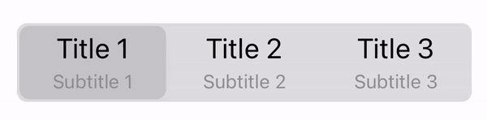

# Custom SwiftUI Segmented Picker

    
    

Demo project with tutorial how to customize  segmented picker in SwiftUI.

👨🏻‍💻 Feel free to subscribe to channel **[SwiftUI dev](https://t.me/swiftui_dev)** in telegram.
